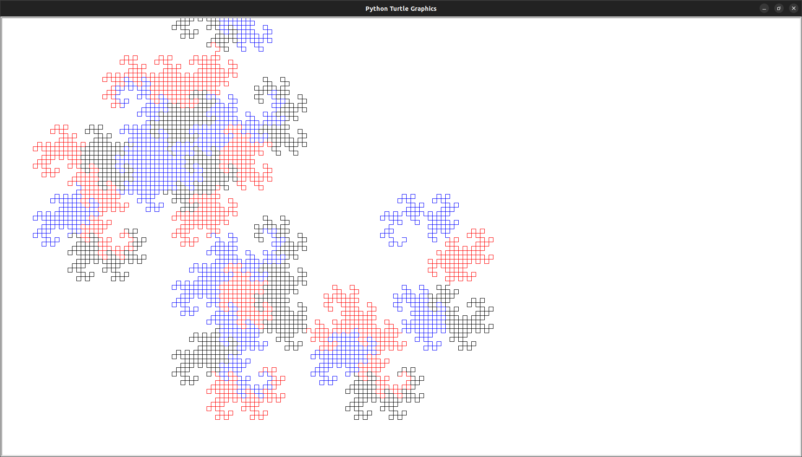

# HEIGHWAY DRAGON FRACTAL

<!---Esses são exemplos. Veja https://shields.io para outras pessoas ou para personalizar este conjunto de escudos. Você pode querer incluir dependências, status do projeto e informações de licença aqui--->



> Fractal do dragão utilizando duas linguagens de programação, Python e C++ Vínculo entre as linguagens utilizando Pybind11 e PythonTurtle para desenho das curvas do fractal.
## 💻 Pré-requisitos

Dependencias:
<!---Estes são apenas requisitos de exemplo. Adicionar, duplicar ou remover conforme necessário--->
* Pybind11 - Version: 2.10.0 `pip3 install pybind11`
* PythonTurtle - Version: 0.3.2 `pip3 install PythonTurtle`.
* Incluir Pybind11 no $PATH

## **📂 Organização dos Arquivos**:

```
├── DRAGON_HEIGHWAY_FRACTAL
    └── src
    ├── dragon.cpp
    ├── fractal_teste.py
    ├── Makefile
    └── README.md
    └── requirements.txt
```
* src -> contém os arquivos do L-system para gerar a gramática do fractal do dragão
* dragon.cpp -> contém a função dragon que retorna a string geradora do fractal e PYBIND11_MODULE que gera o vínculo da função escrita em c++ com Python.
* fractal_teste.py -> Recebe como retorno de dragon.cpp a string geradora do dragon.cpp e desenha utilizando as ferramentas da biblioteca Turtle Graphics.
* Makefile -> Instala as dependencias necessarias e executa o programa

### Compilando o arquivo dragon.cpp e gerando o vínculo
```bash
c++ -O3 -Wall -shared -std=c++11 -fPIC $(python3 -m pybind11 --includes) dragon.cpp -o dragon$(python3-config --extension-suffix)
```
### Executando o programa utilizando Python3
```bash
Python3 fractal_teste.py
```

[⬆ Voltar ao topo](#nome-do-projeto)<br>
